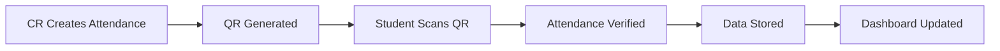
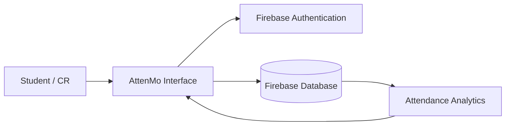

<p align="center">
  
</p>

<h1 align="center">AttenMo</h1>

<p align="center">
  <strong>Smart Attendance Management System for Modern Education</strong>
</p>

<p align="center">
  A digital attendance platform designed for students, Class Representatives (CRs), and educational institutions to manage attendance faster, smarter, and more efficiently.
</p>

<p align="center">
  <a href="https://attenmo.web.app">
    
  </a>
  <a href="https://github.com/shivam238/AttenMo/releases/download/v1.0.0/AttenMo.apk">
    
  </a>
</p>

<p align="center">
  
  
  
  
  
</p>

---

# 📌 About AttenMo

AttenMo is a modern attendance management system that transforms traditional attendance processes into a fast and digital experience.

It helps students monitor attendance, allows Class Representatives to manage records easily, and provides organized attendance insights for better academic management.

## 👥 Who Uses AttenMo?

### 🎓 Students

* Track subject-wise attendance
* View attendance percentage
* Monitor safe attendance limits
* Understand attendance status quickly

### 👑 Class Representatives

* Manage student lists
* Mark attendance digitally
* Maintain attendance records
* Generate class insights

### 🏫 Institutions

* Reduce manual attendance work
* Maintain organized records
* Improve attendance monitoring

---

# ⚡ Problem & Solution

| Problem                                     | AttenMo Solution                 |
| ------------------------------------------- | -------------------------------- |
| Manual attendance takes classroom time      | Digital attendance marking       |
| Paper records are difficult to maintain     | Cloud-based attendance records   |
| Students cannot track attendance easily     | Personal attendance dashboard    |
| Attendance calculations require manual work | Automatic percentage calculation |

---

# ✨ Features

## 📱 QR Based Attendance

Students can mark attendance quickly using QR-based attendance sessions.

## 🎓 Student Dashboard

Students can view:

* Subject attendance
* Attendance percentage
* Attendance status
* Safe margin information

## 👥 CR Management Panel

Class Representatives can:

* Manage students
* Mark attendance
* Update attendance records
* View class information

## 📊 Attendance Analytics

Visual insights help understand:

* Attendance trends
* Subject performance
* Attendance requirements

## 🔐 Secure Authentication

Firebase authentication provides secure user login and access control.

## ⚡ Real-Time Updates

Attendance changes are synchronized instantly across the platform.

---

# 🖼️ Screenshots

Add screenshots here:

```
screenshots/
├── dashboard.png
├── attendance.png
└── analytics.png
```

Example:


---

# 🔄 How AttenMo Works



---

# 💻 Tech Stack

| Category        | Technology              |
| --------------- | ----------------------- |
| Frontend        | HTML5, CSS3, JavaScript |
| Mobile App      | Capacitor               |
| Database        | Firebase                |
| Authentication  | Firebase Auth           |
| Hosting         | Firebase Hosting        |
| Version Control | Git & GitHub            |

---

# 🏗️ Architecture



---

# ⚙️ Installation

```bash
git clone https://github.com/shivam238/AttenMo.git

cd AttenMo
```

Open the project locally or configure your development environment.

---

# 📂 Project Structure

```text
AttenMo/
│
├── public/
│   ├── assets/
│   ├── css/
│   ├── js/
│   └── icons/
│
├── android/
│
├── scripts/
│
├── firebase.json
├── package.json
└── README.md
```

---

# 🚀 Future Roadmap

* [ ] AI-based attendance insights
* [ ] Advanced analytics dashboard
* [ ] Institution management panel
* [ ] Better automation features
* [ ] iOS application support

---

# 🔒 Security

AttenMo follows secure development practices:

* Protected environment variables
* Firebase authentication
* Controlled database access rules
* Secure data communication

---

# 🤝 Contribution

Contributions and suggestions are welcome.

Steps:

```bash
git checkout -b feature-name

git commit -m "Add new feature"

git push origin feature-name
```

Create a Pull Request after your changes.

---

# 👨‍💻 Developer

<p align="center">

<a href="https://github.com/shivam238">

<br>
<b>Shivam</b>
</a>

</p>

Creator & Developer of AttenMo

GitHub:
https://github.com/shivam238

---

<p align="center">
<strong>Built with ❤️ to make attendance smarter, faster, and simpler.</strong>
</p>
