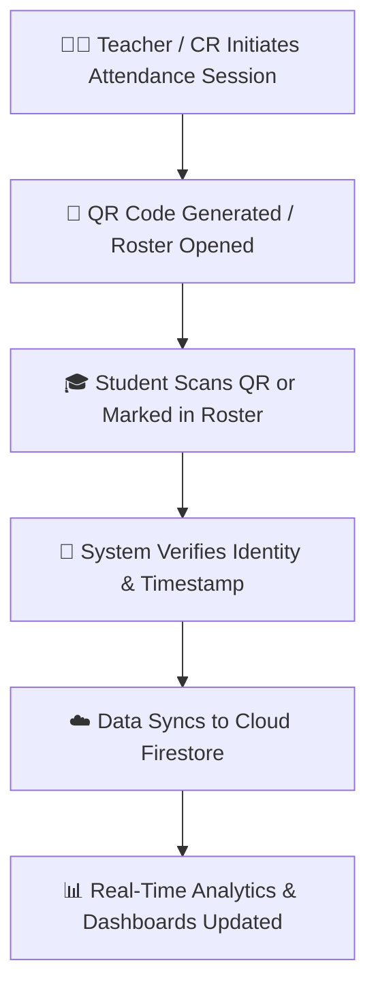
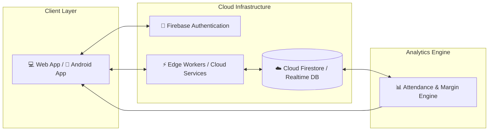

<p align="center">
  
</p>

<h1 align="center">AttenMo</h1>

<p align="center">
  <strong>Smart Attendance Management System for Modern Education</strong>
</p>

<p align="center">
  AttenMo is a high-performance, next-generation digital attendance tracking platform engineered for students, Class Representatives (CRs), and educational institutions. It replaces slow, error-prone manual roll calls with seamless, intelligent digital tracking and real-time academic analytics.
</p>

<p align="center">
  <a href="https://attenmo.web.app">
    
  </a>
  <a href="https://github.com/shivam238/AttenMo/releases/download/v1.0.0/AttenMo.apk">
    
  </a>
  <a href="https://github.com/shivam238/AttenMo/blob/main/README.md">
    
  </a>
</p>

<p align="center">
  
  
  
  
  
  
</p>

---

## 📌 2. About AttenMo

**AttenMo** is an all-in-one digital attendance management ecosystem built to modernize how educational attendance is captured, processed, and analyzed. Traditional pen-and-paper attendance consumes valuable class time, introduces human error, and delays academic feedback. AttenMo bridges this gap with an intuitive web & mobile platform.

### 👥 Who Can Use AttenMo?
* **🎓 Students:** Track individual subject attendance, calculate bunk/attendance safe margins, and monitor threshold compliance in real-time.
* **👑 Class Representatives (CRs):** Manage class rosters, mark attendance in seconds, generate reports, and share updates effortlessly.
* **🏫 Educational Institutions & Faculty:** Gain oversight into attendance trends, streamline records, and reduce administrative workload.

### ⚡ Real-World Impact
By eliminating paper registers and manual data entry, AttenMo saves **5–10 minutes per lecture**, boosts attendance record accuracy, and gives students immediate clarity on their academic eligibility before exam thresholds are breached.

---

## ⚖️ 3. Problem & Solution

| ❌ The Problem | ✅ The AttenMo Solution |
| :--- | :--- |
| **Manual attendance takes time:** Calling out roll numbers wastes up to 15% of class instruction time. | **Digital attendance tracking:** Mark attendance in seconds using quick bulk inputs or QR verification. |
| **Difficult record management:** Paper registers get lost, damaged, or are hard to compile at term end. | **Automated records:** Centralized cloud storage keeps historical logs safe, organized, and accessible 24/7. |
| **Lack of analytics & insights:** Students don't know their exact percentage until official notices arrive. | **Smart analytics:** Instant visual dashboards display percentage progress, bunk limits, and attendance trends. |
| **Unreliable data:** Proxy marking and calculation mistakes cause friction between students and management. | **Easy management:** Secure authentication and real-time syncing ensure transparent, verifiable data. |

---

## ✨ 4. Key Features

### 🎓 Student Attendance Tracker
Keep track of attended, missed, and upcoming lectures per subject with automated percentage calculations. Includes an integrated **Safe Margin Calculator** that informs students how many classes they can skip or need to attend to maintain target thresholds (e.g., 75%).

### 📱 QR-Based Attendance System
Generate temporary, dynamic QR codes for instant student scanning, enabling frictionless, contactless attendance logging during lectures.

### 📊 Attendance Analytics Dashboard
Interactive graphical summaries displaying subject health, attendance distribution, weekly performance, and critical warning alerts for low attendance.

### 👥 CR / Class Management Suite
Empowers Class Representatives with tools to manage student rosters, record daily subject attendance, edit logs, and distribute instant class updates.

### 🔐 Secure Authentication
Robust user management powered by Firebase Authentication, guaranteeing role-based access control for students, CRs, and administrators.

### 📈 Attendance Reports
Export comprehensive class attendance reports into structured formats for faculty submission or personal academic archives.

### ⚡ Real-Time Updates
Instant data synchronization across devices—changes made by a CR reflect immediately on student dashboards without manual page reloads.

### ☁️ Cloud Data Management
Cloud Firestore backbone ensures zero data loss, enterprise-grade scalability, and encrypted data storage accessible anytime, anywhere.

---

## 🖼️ 5. Screenshots / Preview

<p align="center">
  
  <br>
  <em><strong>Figure 1:</strong> Main Dashboard displaying overall attendance percentage, subject health status, and quick action cards.</em>
</p>

<br>

<p align="center">
  
  <br>
  <em><strong>Figure 2:</strong> Interactive Attendance Tracker showing subject breakdown, attendance logs, and bunk limit warnings.</em>
</p>

<br>

<p align="center">
  
  <br>
  <em><strong>Figure 3:</strong> Attendance Analytics view detailing historical trends and threshold target projections.</em>
</p>

---

## 🔄 6. How AttenMo Works

AttenMo operates on a streamlined, automated workflow designed for speed and reliability:



### Workflow Steps:
1. **Session Creation:** Teacher or CR starts an attendance session for a specific subject and class.
2. **Attendance Capture:** Students scan the dynamic QR code via the mobile/web app, or the CR marks attendance digitally.
3. **Verification:** AttenMo validates the user session, timestamp, and class roster permissions.
4. **Cloud Storage:** Attendance records are securely stored in Cloud Firestore in real-time.
5. **Analytics Generation:** Student percentage dashboards and CR summary reports update instantaneously.

---

## 💻 7. Tech Stack

| Category | Technology | Description |
| :--- | :--- | :--- |
| **Frontend** | HTML5, Vanilla CSS3, JavaScript (ES6+) | Clean, zero-dependency modern Web UI with Glassmorphism styling |
| **Mobile Integration** | Progressive Web App (PWA), Capacitor | Native Android app wrapper and offline PWA capabilities |
| **Backend & Cloud** | Firebase Platform, Cloudflare Workers | Cloud Firestore, Realtime Database, Edge API handlers |
| **Authentication** | Firebase Auth | Role-based user authentication & session management |
| **Hosting & CDN** | Firebase Hosting, Cloudflare | Global edge hosting with fast SSL deployment |
| **Tools & Build** | Git, Android Studio, Gradle, Bash Scripts | Cross-platform build scripts & version control |

---

## 🏗️ 8. Application Architecture

AttenMo follows a decoupled, client-cloud architecture optimized for high performance and low latency.



1. **User Interface Layer:** Responsive PWA and Native Android container built with modern HTML/CSS/JS.
2. **Backend Services Layer:** Cloudflare Workers and Firebase Functions handling business logic and API requests.
3. **Database Layer:** Cloud Firestore for structured relational document storage and Realtime Database for active session tracking.
4. **Analytics Engine:** In-browser & cloud algorithms calculating safe margins, attendance percentages, and historical trends.

---

## ⚙️ 9. Installation & Setup

Follow these steps to set up AttenMo locally on your machine:

```bash
# 1. Clone the repository
git clone https://github.com/shivam238/AttenMo.git

# 2. Navigate to the project directory
cd AttenMo

# 3. Install project dependencies
npm install

# 4. Configure environment variables
# Copy the example environment file and add your credentials
cp .env.example .env

# 5. Start the local development server
npm run dev
```

> **Note:** Make sure you have [Node.js](https://nodejs.org/) (v18 or higher) and [npm](https://www.npmjs.com/) installed on your machine.

---

## 📂 10. Project Structure

```text
AttenMo/
├── android/                  # Android Native Project (Capacitor)
├── public/                   # Static Frontend Assets
│   ├── assets/
│   │   ├── css/              # Glassmorphism & UI Component Styles
│   │   ├── js/               # Core Application Logic & Firebase Controllers
│   │   └── icons/            # App Logos and PWA Assets
│   ├── app.html              # Main Student/CR Workspace Application
│   ├── track.html            # Light Student Attendance Portal
│   └── index.html            # Product Landing Page
├── scripts/                  # Build & Maintenance Automation Scripts
│   └── build-app.sh          # Android APK Compilation & Asset Cleaner
├── .env.example              # Environment Variable Template
├── capacitor.config.json     # Mobile Capacitor Configuration
├── firebase.json             # Firebase Hosting & Database Rules
├── package.json              # Node.js Dependencies & Scripts
└── README.md                 # Project Documentation
```

---

## 🚀 11. Future Roadmap

We are continuously evolving AttenMo to bring next-generation capabilities to educators and students:

- [ ] **🤖 AI Attendance Insights:** Predictive ML models to forecast attendance trends and identify at-risk students early.
- [ ] **📈 Advanced Analytics:** Department-wide comparative analytics, filterable trend charts, and automated weekly email digests.
- [ ] **🏛️ Institution Dashboard:** Multi-class administrative panel for college management and HOD oversight.
- [ ] **⚡ Smart Geofencing & Automation:** Location-assisted QR verification to prevent remote proxy scanning.
- [ ] **📱 Native iOS App Support:** Expanding Capacitor mobile targeting to iOS devices via TestFlight.

---

## 🔒 12. Security & Privacy

AttenMo adheres to modern cloud security best practices to protect user privacy and attendance data integrity:

* **Environment Protection:** API keys and sensitive project credentials are isolated using environment configuration patterns (`.env`).
* **Role-Based Authentication:** Firebase Auth guards internal API routes, ensuring students can only access their own attendance records.
* **Data Encryption:** All client-server communication is encrypted in transit via SSL/TLS, and database documents are protected by strict Firestore Security Rules.

---

## 🤝 13. Contribution

Contributions make the open-source community an incredible place to learn, inspire, and create. Any contributions you make are **greatly appreciated**!

1. Fork the Project
2. Create your Feature Branch (`git checkout -b feature/AmazingFeature`)
3. Commit your Changes (`git commit -m 'Add some AmazingFeature'`)
4. Push to the Branch (`git push origin feature/AmazingFeature`)
5. Open a Pull Request

Please review our [CONTRIBUTING.md](CONTRIBUTING.md) and [CODE_OF_CONDUCT.md](CODE_OF_CONDUCT.md) for detailed guidelines.

---

## 👨‍💻 14. Developer

<table align="center">
  <tr>
    <td align="center">
      <a href="https://github.com/shivam238">
        <br />
        <sub><b>Shivam</b></sub>
      </a><br />
      🚀 Creator & Lead Developer
    </td>
  </tr>
</table>

* **GitHub:** [@shivam238](https://github.com/shivam238)
* **LinkedIn:** [Shivam on LinkedIn](https://linkedin.com/in/YOUR_LINKEDIN_USERNAME)
* **Portfolio:** [shivam.dev](https://shivam.dev)

---

<p align="center">
  <strong>Built with ❤️ to make attendance smarter, faster, and simpler.</strong>
</p>
