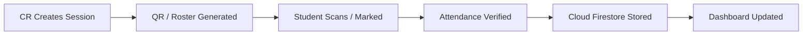
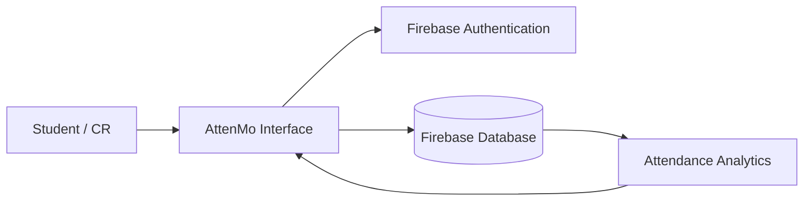

<p align="center">
  
</p>

<h1 align="center">AttenMo</h1>

<p align="center">
  <strong>Smart Attendance Management System for Modern Education</strong>
</p>

<p align="center">
  A digital attendance platform designed for students, Class Representatives (CRs), and educational institutions to manage attendance faster, smarter, and more efficiently.
</p>

<p align="center">
  <a href="https://attenmo.web.app">
    
  </a>
  <a href="https://github.com/shivam238/AttenMo/releases/download/v1.0.0/AttenMo.apk">
    
  </a>
</p>

<p align="center">
  
  
  
  
  
</p>

---

# 📌 About AttenMo

AttenMo is a modern attendance management system that transforms traditional attendance processes into a fast and digital experience.

It helps students monitor attendance, allows Class Representatives to manage records easily, and provides organized attendance insights for better academic management.

## 👥 Who Uses AttenMo?

### 🎓 Students
* Track subject-wise attendance
* View attendance percentage
* Monitor safe attendance limits
* Understand attendance status quickly

### 👑 Class Representatives
* Manage student lists
* Mark attendance digitally
* Maintain attendance records
* Generate class insights

### 🏫 Institutions
* Reduce manual attendance work
* Maintain organized records
* Improve attendance monitoring

---

# ⚡ Problem & Solution

| Problem | AttenMo Solution |
| --- | --- |
| Manual attendance takes classroom time | Digital attendance marking |
| Paper records are difficult to maintain | Cloud-based attendance records |
| Students cannot track attendance easily | Personal attendance dashboard |
| Attendance calculations require manual work | Automatic percentage calculation |

---

# ✨ Features

## 📱 QR Based Attendance
Students can mark attendance quickly using QR-based attendance sessions.

## 🎓 Student Dashboard
Students can view:
* Subject attendance
* Attendance percentage
* Attendance status
* Safe margin information

## 👥 CR Management Panel
Class Representatives can:
* Manage students
* Mark attendance
* Update attendance records
* View class information

## 📊 Attendance Analytics
Visual insights help understand:
* Attendance trends
* Subject performance
* Attendance requirements

## 🔐 Secure Authentication
Firebase authentication provides secure user login and access control.

## ⚡ Real-Time Updates
Attendance changes are synchronized instantly across the platform.

---

# 🔄 How AttenMo Works



---

# 💻 Tech Stack

| Category | Technology | Description |
| --- | --- | --- |
| Frontend | HTML5, CSS3, JavaScript | Modern Web Interface with Glassmorphism UI |
| Mobile App | Capacitor | Native Android application container |
| Database | Firebase Firestore | Realtime Cloud Database |
| Authentication | Firebase Auth | Role-based user login & session security |
| Hosting | Firebase Hosting | Production Edge CDN |
| Version Control | Git & GitHub | Source code management |

---

# 🏗️ Architecture



---

# ⚙️ Installation

```bash
# Clone the repository
git clone https://github.com/shivam238/AttenMo.git

# Navigate into directory
cd AttenMo

# Install dependencies
npm install

# Start development server
npm run dev
```

---

# 📂 Project Structure

```text
AttenMo/
├── android/                  # Native Android App (Capacitor)
├── public/                   # Static Frontend & Web Assets
│   ├── assets/
│   │   ├── css/              # UI & Glassmorphism Styles
│   │   ├── js/               # Core Logic & Firebase Controllers
│   │   └── icons/            # App Icons
│   ├── app.html              # Student/CR Main App
│   ├── track.html            # Light Attendance Portal
│   └── index.html            # Product Landing Page
├── scripts/                  # Build Automation
├── firebase.json             # Hosting Configuration
├── package.json              # App Dependencies
└── README.md                 # Documentation
```

---

# 🚀 Future Roadmap

* [ ] AI-based attendance insights & predictions
* [ ] Advanced analytics dashboard & exports
* [ ] Multi-class institution management panel
* [ ] Geofenced QR attendance security
* [ ] Native iOS application support

---

# 🔒 Security

AttenMo follows secure development practices:
* Protected environment configurations
* Role-based Firebase authentication
* Controlled database security rules
* Encrypted client-server communications

---

# 🤝 Contribution

Contributions and suggestions are welcome!

1. Fork the Project
2. Create your Feature Branch (`git checkout -b feature/AmazingFeature`)
3. Commit your Changes (`git commit -m 'Add AmazingFeature'`)
4. Push to the Branch (`git push origin feature/AmazingFeature`)
5. Open a Pull Request

---

# 👨‍💻 Developer

<div align="center">
  <h3><b>Shivam Kumar Mahto</b></h3>
  <p>🚀 <i>Creator & Lead Developer of AttenMo</i></p>
  
  <a href="https://github.com/shivam238">
    
  </a>
</div>

---

<p align="center">
  <strong>Built with ❤️ to make attendance smarter, faster, and simpler.</strong>
</p>
